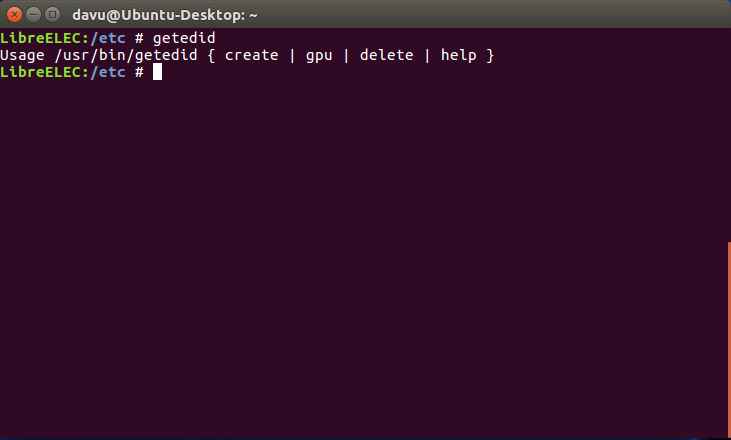

# EDID

## Custom EDID

To change the order of turning on your devices \(normally your HTPC has to be powered on last\) or to use your LibreELEC device without the TV turned on, you need to dump/save the EDID information from your TV \(or AVR\).

In the steps below we will explain how this can be done:

**Note:** Your devices should all be turned on and you should have a screen and audio working. Otherwise the EDID information aren't provided properly and this How-To won't work.

In the tabs below we explain different ways how to dump the EDID information. Intel explains the steps which need to be done for Intel based GPUs and nVidia will explain the same steps for nVidia based GPUs which will differ much from each other. We also provide a script which does the needed things for the specific GPUs automatically.

## Generic x86\_64

**Note:** This script will also only work for Intel or nVidia based GPUs. AMD/ATI GPU's are not supported.

To use the getedid script you need to have SSH access to your LibreELEC machine.

Once you are in, just type in

```text
getedid
```

to see which options are available. It will look like this.



The available options are `create`, `gpu`, `delete` and `help`. These are explained below.

#### getedid help

This will show a help message and a little explanation for the specific options.

#### getedid gpu

This will check which GPU you are using and you will either get "Intel", "NVidia" or "GPU is not supported" after running that command.

#### getedid create

This will do all needed steps which are needed to dump the EDID for the GPU you are using. It first checks if the GPU is supported, then it checks if you already have done changes to the files which the script needs to change, too. If you already have done some changes to those files, the script will stop and you should dump the EDID manually. Those steps are explained in the other tabs. The reason for that is, that we can't know what you already have changed and therefore the script might do something horrible wrong and we don't want to break your system. As you already know how to edit those files it should not be that hard to do that again.

If the files are like they should be from a vanilla installation, the script does its thing and will do everything which is necessary and reboot your machine after everything is done as expected.

After that you shouldn't take care about the ordering how to turn on your devices, anymore. Your HTPC should also be turned on as the first device in the chain now.

#### getedid delete

This will delete all the created files from `getedid create` if you have used it before. After using `getedid delete` the default configuration is restored. No unneeded files on it, everything is like a vanilla installation and you have to take care about the ordering how to turn on your devices again.

For the source of that script please look at: [https://github.com/LibreELEC/LibreELEC.tv/blob/master/packages/sysutils/busybox/scripts/getedid](https://github.com/LibreELEC/LibreELEC.tv/blob/master/packages/sysutils/busybox/scripts/getedid)

### Intel

#### Get the needed information about your system

First, you have to SSH in your LibreELEC machine. Then enter the following command.

```text
tail /sys/class/drm/*/status
```

Look for the connected device:


```text
==> /sys/class/drm/card0-HDMI-A-2/status <==
connected
```

The information we need **HDMI-A-2** is connected.

#### Create the EDID file

Now we will create a copy of the EDID binary data and put it where it needs to go. Change the cat command to match the active HDMI/DP port. For the possibility to copy and paste the correct commands, change the tabs below to the matching port.

```text
mkdir -p /storage/.config/firmware/edid
```

HDMI-A-1

```text
cat /sys/class/drm/card0-HDMI-A-1/edid > /storage/.config/firmware/edid/edid.bin</code>
```

HDMI-A-2

```text
cat /sys/class/drm/card0-HDMI-A-2/edid > /storage/.config/firmware/edid/edid.bin</code>
```

Next a cpio archive file will be created which will be loaded at boot.

```text
cd ~
mkdir -p cpio/lib/firmware/edid
cp .config/firmware/edid/edid.bin cpio/lib/firmware/edid/
cd cpio/
find . -print | cpio -ov -H newc > ../edid.cpio
```

#### Editing the extlinux.conf or syslinux.cfg

Now mount the boot partition as "RW" and move the file to it

```text
mount -o remount,rw /flash
mv ../edid.cpio /flash/
```

After the file is moved to the correct place, we have to add some boot parameters. For this we have edit either the "extlinux.conf" or the "syslinux.cfg" file in your /flash/ directory. Use this command to check which one is available.

```text
ls /flash/
```

Search for "extlinux.conf" or "syslinux.cfg" and edit it. Only one of them is available.

**syslinux.cfg**

```text
nano -w /flash/syslinux.cfg
```

**extlinux.conf**

```text
nano -w /flash/extlinux.conf
```

Add to the APPEND line the following things.

HDMI-A-1

```text
initrd=/edid.cpio drm_kms_helper.edid_firmware=HDMI-A-1:edid/edid.bin video=HDMI-A-1:D
```

The APPEND line should look this like this after \(everything in a single line\):

```text
APPEND boot=LABEL=System disk=LABEL=Storage ssh quiet initrd=/edid.cpio drm_kms_helper.edid_firmware=HDMI-A-1:edid/edid.bin video=HDMI-A-1:D
```

HDMI-A-2

```text
initrd=/edid.cpio drm_kms_helper.edid_firmware=HDMI-A-2:edid/edid.bin video=HDMI-A-2:D
```

The APPEND line should look this like this after \(everything in a single line\).

```text
APPEND boot=LABEL=System disk=LABEL=Storage ssh quiet initrd=/edid.cpio drm_kms_helper.edid_firmware=HDMI-A-2:edid/edid.bin video=HDMI-A-2:D
```

Last step is to reboot the device.

```text
reboot
```

### nVidia

If you boot your nVidia GPU based LibreELEC box before the TV/AVR and you see a black screen on boot - follow this guide to create an edid.bin file that tricks Xorg into thinking the TV/AVR are powered on at boot time.

**Note:** This example will NOT work on Intel or AMD GPU's.

#### Get the needed information about your system

Open an SSH session to your LibreELEC machine. Once logged into the console we need to work out the DFP number. 

```text
grep ": connected" /var/log/Xorg.0.log | head -n 1
```

You should see message like the following:

```text
  [3241512.110] (--) NVIDIA(0): SAMSUNG (DFP-0): connected
```

Note the DFP number - in this example it is "DFP-0" but yours may be different.

#### Set Xorg to Debug Mode

To extract EDID data we need we need to place Xorg into debug mode. First we stop Xorg.

```text
systemctl stop xorg.service
```

Next we clone the xorg.conf to the config override location in `/storage/.config`.

```text
cp /etc/X11/xorg-nvidia.conf /storage/.config/xorg.conf
```

Then we edit the file with `sed` to enable debug mode.

```text
sed -i 's/"ModeDebug" "false"/"ModeDebug" "true"/g' /storage/.config/xorg.conf
```

The device section in the modified file should look something like this.

```text
Section "Device"
    Identifier     "nvidia"
    Driver         "nvidia"
    Option         "DynamicTwinView" "False"
    Option         "NoFlip" "false"
    Option         "NoLogo" "true"
    Option         "ConnectToAcpid" "0"
    Option         "FlatPanelProperties" "Scaling = Native"
    Option         "ModeValidation" "NoVesaModes, NoXServerModes"
    Option         "HWCursor" "false"
    Option         "ModeDebug" "true"
EndSection
```

Now restart Xorg.

```text
systemctl start xorg.service
```

#### Create the EDID file

Extract the RAW binary EDID information from the debug /var/log/Xog.0.log to a file.

```text
nvidia-xconfig --extract-edids-from-file=/var/log/Xorg.0.log --extract-edids-output-file=/storage/.config/edid.bin
```

The command should output something like.

```text
Found 1 EDID in "/var/log/Xorg.0.log".
Wrote EDID for "ONK TX-NR616 (DFP-0)" to "/storage/.config/edid.bin" (256 bytes).
```

#### Edit xorg.conf

Now we edit /storage/.config/xorg.conf - set ModeDebug back to False \(edit the word true to false\) and uncomment the following lines.

```text
Option         "ConnectedMonitor" "DFP-0"
Option         "CustomEDID" "DFP-0:/storage/.config/edid.bin"
Option         "IgnoreEDID" "false"
Option         "UseEDID" "true"
```

Make sure you change the DFP number to match the one we found earlier. In the end your config will look something like.

```text
Section "Device"
  Identifier     "nvidia"
  Driver         "nvidia"
  Option         "DynamicTwinView" "False"
  Option         "NoFlip" "false"
  Option         "NoLogo" "true"
  Option         "ConnectToAcpid" "0"
  Option         "FlatPanelProperties" "Scaling = Native"
  Option         "ModeValidation" "NoVesaModes, NoXServerModes"
  Option         "HWCursor" "false"
  Option         "ModeDebug" "false"
  Option         "ConnectedMonitor" "DFP-0"
  Option         "CustomEDID" "DFP-0:/storage/.config/edid.bin"
  Option         "IgnoreEDID" "false"
  Option         "UseEDID" "true"
EndSection
Section "Screen"
  Identifier     "screen"
  Device         "nvidia"
  DefaultDepth    24
  Option         "ColorRange" "Full"
 #    Option         "ColorRange" "Limited"
 #    Option         "ColorSpace" "RGB"
  SubSection     "Display"
   Depth       24
  EndSubSection
EndSection
Section "Extensions"
  Option         "Composite" "false"
EndSection
```

Finally we stop/restart xorg.service to disable debug mode and use the new edid.bin file.

```text
systemctl restart xorg.service
```

If all has gone to plan Xorg now detects the EDID file and the order of powering on equipment no longer matters!

## Amlogic \(Legacy\)

Amlogic legacy kernel devices \(using 3.10, 3.14 kernels\) do not capture "edid.bin" files like Intel and nVidia devices, but a similar process can capture, store and force the resolutions of a device. Connect your HTPC device directly to the HDMI source that you want to capture EDID information from, then login over SSH and run the following command.

```text
cat /sys/class/amhdmitx/amhdmitx0/disp_cap > /storage/.kodi/userdata/disp_cap
```

This stores a list of the supported resolutions. It looks like

```text
480p60hz
480p_rpt
576p50hz
720p60hz
1080i60hz
1080p60hz
720p50hz
1080i50hz
1080p30hz
1080p50hz
1080p25hz
1080p24hz
2160p30hz
2160p25hz
2160p24hz
smpte24hz
smpte25hz
smpte30hz
smpte50hz
smpte60hz
smpte50hz420
smpte60hz420
2160p50hz
2160p60hz
2160p50hz420
2160p60hz420
```

To remove or add specific resolutions, e.g. if 1080p24hz is missing, edit disp\_cap.

```text
nano /storage/.kodi/userdata/disp_cap
```

Ctrl+o to save, Ctrl+x to exit the nano editor. Next restart Kodi by rebooting the box or running.

```text
systemctl restart kodi
```

