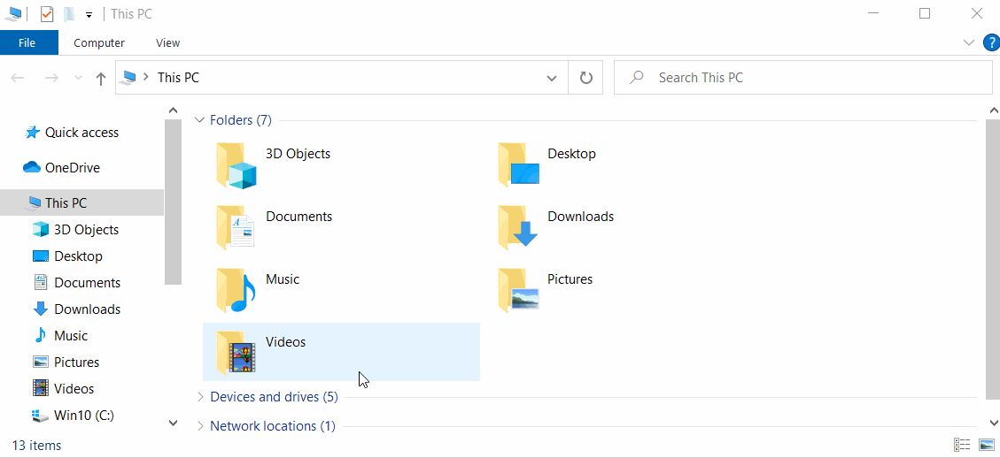

# Add Firmware

Linux kernel firmware files are normally installed in `/usr/lib/firmware` but in LibreELEC this directory is inside the read-only `SYSTEM` file preventing you from adding more files. To allow user changes we support an overlay system. You can copy your firmware files and subfolders to `/storage/.config/firmware` and reboot. On boot the new folders/files will be overlaid onto `/usr/lib/firmware` where kernel drivers expect to see them.

### Example

The following text from `dmesg` shows the kernel failing to load `rtl8761a_config.bin`which is needed for a Bluetooth device to work:

```text
[    8.641489] Bluetooth: hci0: RTL: rtl: loading rtl_bt/rtl8761a_fw.bin
[    9.241371] bluetooth hci0: Direct firmware load for rtl_bt/rtl8761a_fw.bin failed with error -2
```

This can be fixed by creating the overlay directories and downloading the missing firware file from the linux-firmware repository, then rebooting.

```text
mkdir -p /storage/.config/firmware/rtl_bt
cd /storage/.config/firmware/rtl_bt
wget https://git.kernel.org/pub/scm/linux/kernel/git/firmware/linux-firmware.git/plain/rtl_bt/rtl8761a_fw.bin
Connecting to git.kernel.org (136.144.49.103:443)
saving to 'rtl8761a_fw.bin'
rtl8761a_fw.bin      100% |**********************************| 74488  0:00:00 ETA
'rtl8761a_fw.bin' saved
reboot
```

Firmware files can also be copied via the local Samba/SMB shares, as shown below:



