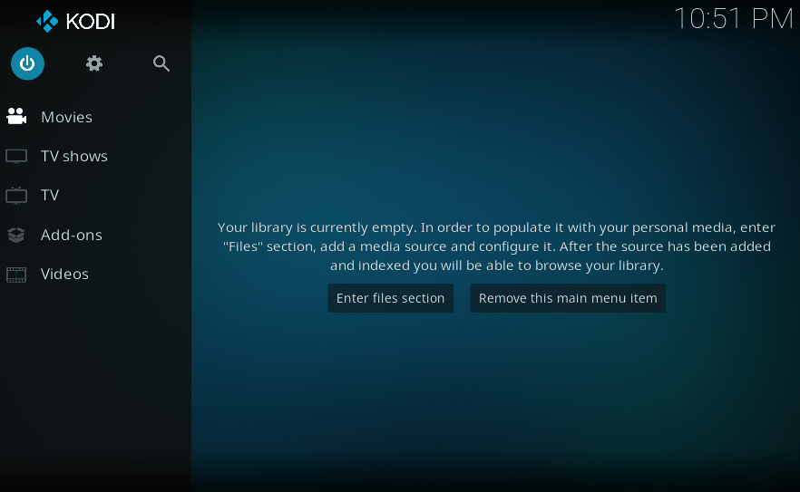

# Force Add-on Update

To force-update an add-on repository:

1. Kodi 
2. Add-ons
3. Box icon
4. left arrow for the side menu
5. Check for updates
6. the date at the bottom should change to the current time

